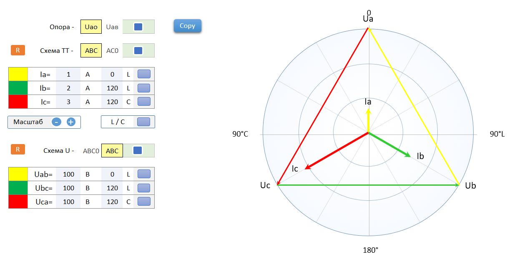

# Векторная диаграмма для электросчётчика v.2022

Предназначена для отображения векторной диаграммы для электросчётчика.

## Основные характеристики:
- Отображение тока,напряжения с направлением и наименованием вектора
- Выбор системы координат (Градусы, L/C)
- Выбор схемы ТТ (ABC, AC0)
- Выбор напряжения (ABC, ABC0)
- Выбор опорного напряжения (Ua, Uab)
- Автомастштабирование
- Выбор масштаба
- Копирование диаграммы в буфер обмена

## Внешний вид

> [!NOTE]
> Код показан в качестве демонстрации для резюме.

## Author

- [@Norexy](https://github.com/Norexy)
